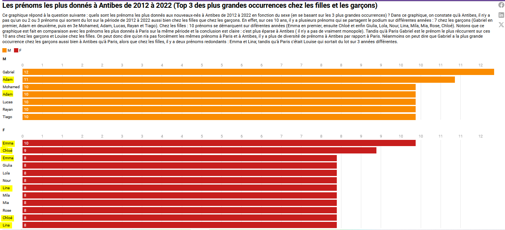

# Datavisualisation sur les prénoms des nouveaux-nés
NB : Ceci est une page Github réalisée dans le cadre du cours de datavisualisation en M2 Documents électroniques et flux d'informations (Université Paris Nanterre)
# Prénoms des nouveaux-nés des villes d'Antibes et de Paris
.jpg) 
Téléchargé à partir de Pixabay : https://pixabay.com/photos/twins-babies-newborn-boys-1628843/ 
# Sommaire 
1. [Introduction : présentation du projet](#presentation)
2. [Jeux de données et Sprint qualité](#donnéesBrutes)
3. [Visualisation des données](#visualisation)
4. [Conclusion](#conclusion)
5. [Leçon Retenue](#Leçon)

## Introduction : présentation du projet 
Ce travail porte sur les prénoms des nouveaux-nés déclarés dans les villes d'Antibes et de Paris pendant 10 ans. Nous cherchons ainsi à comprendre s'il y a une différence entre les prénoms données dans une ville en bord de mer et une ville en pleine terre. Les couvertures spatiales n'étant pas les mêmes, nous avons choisi de partir sur la tranche commune aux deux jeux de données et la plus récente d'où la sélection de la période de _2012 à 2022_.

## Jeux de données et Sprint qualité 
**_ANTIBES :_**

Pour le jeu de données de la ville d'Antibes, nous avons procédé à un sprint qualité en nous basant sur 10 questions principales (soft sprint qualité : grille donnée par monsieur Antoine Courtin). Puis nous avons procédé à la rectification du fichier CSV de base pour respecter le schema destiné aux prénoms des nouveaux nés accessible via ce [lien](https://schema.data.gouv.fr/scdl/prenoms/).
Et enfin nous avons été sur : [etalab](https://publier.etalab.studio/fr/) pour vérifier la conformité du fichier après avoir rectifié les erreurs détectées dans le rapport. 

Ci-dessous, un apperçu du jeu de données mis à disposition par la ville d'Antibes [Source](https://trouver.datasud.fr/dataset/prenoms-des-nouveaux-nes-de-la-ville-antibes-juan-les-pins/resource/c49b3327-31d1-4d34-b90b-2d1585a20327).

<iframe width="700" height="400" src="https://trouver.datasud.fr/dataset/prenoms-des-nouveaux-nes-de-la-ville-antibes-juan-les-pins/resource/c49b3327-31d1-4d34-b90b-2d1585a20327/view/863f8775-bb1a-427e-8ba6-503d847624f2" frameBorder="0"></iframe>
 
+ Fichier de base mis à disposition par la ville d'Antibes : [Fichier de base des prénoms de nouveaux-nés de la ville d'Antibes](https://github.com/DieynabaKOUYATE/Datavisualisation_Prenoms_Nouveaux-nes_Dieynaba_KOUYATE/blob/main/antibes-prenoms-naissance.csv)

Ci-joint, les détails de ce sprint qualité :
+ Sprint qualité :
  [SprintQualite_Soft_DieynabaKouyate_M2_DEFI_2024.pdf](https://github.com/DieynabaKOUYATE/Datavisualisation_Prenoms_Nouveaux-nes_Dieynaba_KOUYATE/files/13920336/SprintQualite_Soft_DieynabaKouyate_M2_DEFI_2024.pdf)

+ Processus de correction pour respect du schéma : 
  [SchemaDonnees_Prenoms_DieynabaKouyate_M2_DEFI_2024.pdf](https://github.com/DieynabaKOUYATE/Datavisualisation_Prenoms_Nouveaux-nes_Dieynaba_KOUYATE/files/13920341/SchemaDonnees_Prenoms_DieynabaKouyate_M2_DEFI_2024.pdf)
  
+ Fichier corrigé et respectant le schéma des prénoms : [Corrigé du fichier de base](https://github.com/DieynabaKOUYATE/Datavisualisation_Prenoms_Nouveaux-nes_Dieynaba_KOUYATE/blob/main/antibes-prenoms-naissance_corrige.csv)

**_PARIS :_** 

Concernant ce deuxième jeu de données, nous estimons que le seul respect du schema est garant de cohérence et de qualité. Ainsi, nous n'avons pas appliqué la grille "soft sprint qualité" mais avons opté pour la correction des données en vue de respecter le schéma. 
Pour ce faire, nous avons été sur le site de la ville de paris pour télécharger le jeu de données des prénoms déclarés en CSV. Pour prémacher le travail de visualisation, nous avons fait un filtre sur les années en les reserrant sur la période de 2012-2022. [Source](https://opendata.paris.fr/explore/dataset/liste_des_prenoms/export/?disjunctive.annee&disjunctive.prenoms&q.timerange.annee=annee:%5B2012-01-01+TO+2022-12-31%5D).

 

Nous avons téléchargé le fichier CSV et l'avons rectifié :
+ Renommage des colonnes pour y mettre les intitulés listés dans le schéma 
+ Suppression de la colonne "Nombre total cumule par annee"
+ Sprint qualité du fichier CSV via [etalab](https://publier.etalab.studio/fr/), nous avons détecté le non respect du schema car il y avait la colonne insee manquante
+ Ajout de la colonne "COLL_INSEE"
+ Nouvelle vérification sur [etalab](https://publier.etalab.studio/fr/) et le fichier est déclaré conforme.

Pour récupérer les 2 fichiers :
+ Fichier de base mis à disposition par la ville de Paris : [Jeu de données source des prénoms de nouveaux-nés à Paris](https://github.com/DieynabaKOUYATE/Datavisualisation_Prenoms_Nouveaux-nes_Dieynaba_KOUYATE/blob/main/Paris_liste_des_prenoms.csv)
+ Fichier corrigé : [Corrigé du jeu de données de la  ville de Paris](https://github.com/DieynabaKOUYATE/Datavisualisation_Prenoms_Nouveaux-nes_Dieynaba_KOUYATE/blob/main/Paris_prenoms_corriges.csv). Attention : ce fichier csv a été repris à la fin (en réalité le premier fichier corrigé avait comme séparateur le point virgule ";" et pas la virgule ",". C'est d'ailleurs pour cela que j'ai dû créer par la suite un fichier assemblage.csv pour y rassembler les données d'Antibes te Paris afin de faire le traitement sur OpenRefine). Pour plus de conformité et une meilleure lisibilité, on l'a repris et l'avons enregoistré sous format csv avec la virgule comme séparateur.
  
+ Ci-dessous, un apperçu des données mises à disposition : 
<iframe src="https://opendata.paris.fr/explore/embed/dataset/liste_des_prenoms/table/?disjunctive.annee&disjunctive.prenoms&q.timerange.annee=annee:%5B2012-01-01%20TO%202022-12-31%5D&static=false&datasetcard=false" width="600" height="450" frameborder="0"></iframe>

Ensuite, nous avons été sur [WTF CSV](https://databasic.io/en/wtfcsv/#upload), pour changer l'approche du "sanity check" et avoir quelques visualisations permettant d'avoir des informations générales. 

Ainsi, on sait que sur notre corpus de prénoms déclarés entre 2012 et 2022 dans la ville de paris :
+ Il y a 14201 lignes dans notre fichier
+ 5 prénoms se démarquent avec une occurrence de 22 : Alix, Andrea, Camille, Charlie et Eden
+ Il y a au moins 1270 prénoms de nouveaux nés déclarés dans la ville de paris sur chaque intervalle d'un an
+ Les occurrences les plus fréquentes varient de 5 à 43 : 12217 occurrences comprises dans l'intervalle 5-43
+ Il y a plus de filles déclarées que de garçons
+ Les valeurs 75056 et Paris sont répétés 14201 fois

  

## Visualisation des données 

> **Avant toute chose : où se trouve les deux villes en questions ?**

Pour effectuer nos visualisations, nous avons assemblé les jeux de données dans un seul fichier en restant uniquement sur la période 2012-2022. Ensuite, nous avons utilisé OpenRefine pour enrichir les données avec wikidata (en y ajoutant les localisations) afin de pouvoir situer les 2 villes sur une carte à travers Umap. Mais avant, différentes manipulations ont été nécessaires. 

Voir l'historique d'OpenRefine dans le répertoire :  [Historique_OpenRefine.json](https://github.com/DieynabaKOUYATE/Datavisualisation_Prenoms_Nouveaux-nes_Dieynaba_KOUYATE/blob/main/history.json)

+ On a dû créer un fichier "assemblage.csv" où on a rassemblé les données des 2 villes dans un seul fichier CSV. On voulait le faire directement sur OpenRefine (car c'est possible si les jeux de données ont la même structure) mais il y avait un souci : le fichier de la ville de Paris était un "faux csv" le séparateur était le point virgule et non la virgule (comme sur le jeu de données de la ville d'Antibes). Pour palier à ce souci, nous avons créé le fichier "assemblage.csv" sur LibreOffice avant de faire le traitement et l'enrichissement sur OpenRefine.
  
+ Pour le traitement des jeux de données, on a d'abord réglé la question des clusters. Un même prénom pouvait avoir différentes orthographes. On a choisi l'orthographe qui nous semblait la plus correcte / la plus utilisée (voir image) .

Sur la carte ci-dessous : les localisations d'Antibes et de Paris. Carte réalisé à partir de [ce fichier](https://github.com/DieynabaKOUYATE/Datavisualisation_Prenoms_Nouveaux-nes_Dieynaba_KOUYATE/blob/main/assemblage15janv.geojson)

<iframe width="100%" height="800px" frameborder="0" allowfullscreen allow="geolocation" src="//umap.openstreetmap.fr/en/map/lieu-de-naissance-des-198-prenoms-qui-ont-le-plus-_1009761?scaleControl=false&miniMap=false&scrollWheelZoom=false&zoomControl=true&editMode=disabled&moreControl=true&searchControl=null&tilelayersControl=null&embedControl=null&datalayersControl=true&onLoadPanel=undefined&captionBar=false&captionMenus=true"></iframe>
<a href="//umap.openstreetmap.fr/en/map/lieu-de-naissance-des-198-prenoms-qui-ont-le-plus-_1009761?scaleControl=false&miniMap=false&scrollWheelZoom=true&zoomControl=true&editMode=disabled&moreControl=true&searchControl=null&tilelayersControl=null&embedControl=null&datalayersControl=true&onLoadPanel=undefined&captionBar=false&captionMenus=true">See full screen</a>

Nous avons voulu représenté les données sous une autre forme visuelle : des "scatter plots" dont les tailles varient en fonction des occurrences. Pour ce faire, on est parti sur un corpus très réduits avec uniquement les colonnes prénoms, sexe, nom de la commune, année. Pour arriver à ce résulat, il fallait faire des choix et la question principale était la suivante : sur quoi se baser pour choisir certains prénoms à la place d'autres? La réponse nous semblait évidante : partir sur les 3 premiers prénoms par années et par ville afin d'avoir un corpus réduit des Top 3. 
Nous avons entamé cette démarche sur OpenRefine et nous sommes rendus compte que cela n'était pas un critères suffisant : on pouvait avoir 4 prénoms qui ont le même nombre d'occurrence pour une même année. Afin d'éviter cet obstacle, on est plutôt parti sur les 3 plus grandes occurrences de prénoms par année et par ville. Autrement dit si on a plus de 3 prénoms qui ont néanmoins la même occurrence et que cette occurrence fait partie des 3 premières, on les sélectionne tous. 

Pour avoir un corpus Top 3 des occurrences, à partir de notre fichier "assemblage.csv" on a :
+ appliquer des facettes sur les noms de commune  
+ appliquer des facettes sur les années (par intervalle d'un an sauf pour la dernière année où on a "filtré le texte" pour rechercher la valeur exacte "2022" afin d'avoir les lignes correspondantes) 
+ trier par ordre décroissant les nombres d'occurrences afin de voir les plus grandes en premier (en restant sur les facettes précédentes car sinon la commune de était toujours première car c'est là-bas qu'on a les plus grandes occurrences)
+ étoiler les prénoms qui répondent aux critères
+ quitter les facettes pour retourner dans l'onglet "Défaire/Refaire"
+ appliquer une facette par étoile à la colonne "toutes" 
+ **au final on a eu un corpus de 213 prénoms au total à analyser: 66 à Paris et 147 à Antibes** 

En outre, on a décidé de faire 2 visuelles séparées pour les 2 villes afin que ce soit un peu plus digeste à regarder. On a décidé d'appliquer un filtre sur les années afin qu'on puisse visualiser pour chaque ville les différences/ressemblances en fonction des années. On a appliqué les couleurs pas en fonction des prénoms car on ne le trouve pas pertinent mais en fonction des sexes. 

**(Première version) Antibes : les prénoms les plus donnés aux nouveaux nés par année de 2012 à 2022**

Ici, on voulait faire les Top3 des prénoms les plus donnés mais il y avait des ex aequo et à chaque fois que c'était le cas, je les prenais tous. C'est pour cela qu'on n'a pas seulement 6 prénoms par année.

<iframe src='https://flo.uri.sh/visualisation/16564724/embed' title='Interactive or visual content' class='flourish-embed-iframe' frameborder='0' scrolling='no' style='width:100%;height:600px;' sandbox='allow-same-origin allow-forms allow-scripts allow-downloads allow-popups allow-popups-to-escape-sandbox allow-top-navigation-by-user-activation'></iframe>

**(Version corrigée) Antibes : les prénoms donnés au moins 10 fois de 2012 à 2022**

Pour palier au problème des ex aequo, on a décidé de faire un autre graphique plus digestes : représenter les prénoms qui ont été donnés au moins 10 fois à Antibes sur la période de 2012 à 2022.

<iframe src='https://flo.uri.sh/visualisation/16641441/embed' title='Interactive or visual content' class='flourish-embed-iframe' frameborder='0' scrolling='no' style='width:100%;height:600px;' sandbox='allow-same-origin allow-forms allow-scripts allow-downloads allow-popups allow-popups-to-escape-sandbox allow-top-navigation-by-user-activation'></iframe>

**(Première version) Paris : les 66 prénoms les plus donnés aux nouveaux nés de 2012 à 2022**

Toujours sur le même principe des ex aequo, on a pris les top 3 des prénoms les plus donnés y compris les ex aequo d'où les 66 prénoms.

<iframe src='https://flo.uri.sh/visualisation/16554580/embed' title='Interactive or visual content' class='flourish-embed-iframe' frameborder='0' scrolling='no' style='width:100%;height:600px;' sandbox='allow-same-origin allow-forms allow-scripts allow-downloads allow-popups allow-popups-to-escape-sandbox allow-top-navigation-by-user-activation'></iframe>

**(Version Corrigée) Paris : les prénoms donnés au moins 300 fois de 2012 à 2022**

Pour palier au problème des ex aequo, j'ai mis en exergue dans le graphique ci-dessous les prénoms qui ont été donné au moins 300 fois.

<iframe src='https://flo.uri.sh/visualisation/16641932/embed' title='Interactive or visual content' class='flourish-embed-iframe' frameborder='0' scrolling='no' style='width:100%;height:600px;' sandbox='allow-same-origin allow-forms allow-scripts allow-downloads allow-popups allow-popups-to-escape-sandbox allow-top-navigation-by-user-activation'></iframe>

**(Première Version) Les 213 prénoms les plus donnés à Antibes et Paris**
<iframe src='https://flo.uri.sh/visualisation/16565616/embed' title='Interactive or visual content' class='flourish-embed-iframe' frameborder='0' scrolling='no' style='width:100%;height:600px;' sandbox='allow-same-origin allow-forms allow-scripts allow-downloads allow-popups allow-popups-to-escape-sandbox allow-top-navigation-by-user-activation'></iframe>

Dans cette visualisation ci-dessus on a l'impression qu'il n'y a que des prénoms de nouveaux-nés de la ville de Paris en raison du grand écart des occurrences entre Paris et Antibes. Cela nous avait déjà interpellé lors du traitement des données sur OpenRefine. En effet, pour étoiler les Top 3 des occurrences, j'ai a essayé la méthode "facile" : tri par ordre décroissant sur la colonne "NOMBRE_OCCURRENCE". Puis, je me suis rendue compte que la ville de Paris était toujours en premier sur toutes les années car elle a de grandes occurrences. D'où le recours aux facettes. Grâce à un tableau croisé dynamique, on a pu savoir que le nombre total des prénoms déclarés sur ces 10 ans à Paris s'élève à *338.938* tandis qu'à Antibes c'est plutôt *11.155* sur la même période. C'est ce qui explique une meilleure visibilité des prénoms déclarés à Paris par rapport à Antibes. De là, on s'est dit qu'il vaudrait mieux montrer l'évolution des déclaration des prénoms de nouveaux-nés dans les 2 villes de 2012 à 2022 (voir graphique ci-dessous / nb : moyennes recueillies grâce à aux tableaux croisés dynamiques sur les fichiers de bases de chaque ville). 

> En moyenne combien de prénoms sont déclarés à Paris et à Antibes ? 

<iframe title="Moyenne des prénoms de nouveaux-nés déclarés à Paris et à Antibes (2012-2022)" aria-label="Interactive line chart" id="datawrapper-chart-mngyu" src="https://datawrapper.dwcdn.net/mngyu/1/" scrolling="no" frameborder="0" style="width: 0; min-width: 100% !important; border: none;" height="400" data-external="1"></iframe>

**(Version Corrigée) Les 13 prénoms les plus donnés aux nouveaux-nés à Antibes et à Paris (filles et garçons)**
Compte-tenu de l'analyse précédente où on a vu qu'il y a un grand écart entre les deux villes concernant la moyenne de déclaration des prénoms de nouveaux nés, on est parti sur Des critères de sélections différentes (en fonction de la ville). 

+ Connaître les prénoms qui sont donnés à paris au moins 300 fois
+ Connaître les prénoms qui sont donnés à Antibes au moins 10 fois

Etant donné que c'est un travail repris, on a choisi des occurrences assez élevées dans chaque ville afin d'avoir un corpus très réduit et gagner du temps pour refaire la visualisation. La visualisation ci-après est donc une Représentation des prénoms les plus donnés à Antibes (qui ont au moins 10 occurrences) associés aux prénoms les plus donnés à Paris (qui ont au moins 300 occurrences)

<iframe src='https://flo.uri.sh/visualisation/16645049/embed' title='Interactive or visual content' class='flourish-embed-iframe' frameborder='0' scrolling='no' style='width:100%;height:600px;' sandbox='allow-same-origin allow-forms allow-scripts allow-downloads allow-popups allow-popups-to-escape-sandbox allow-top-navigation-by-user-activation'></iframe>

On peut voir dans ce visuel qu'à Paris comme à Antibes, les prénoms donnés aux filles sont beaucoup plus variés ; il n'y a que Emma(à Antibes) et Louise (à Paris) dans notre Top 10 des prénoms les plus donnés. Tandis que chez les garçons, il y a quand même quelques prénoms qui reviennent souvent au fil des années dont Adam, Gabriel, Raphael. 

Remarque : pour des raisons pédagogiques, les visualisations ont été reprises (pour montrer qu'on a compris la logique de ce qu'il ne faut pas faire et de ce qui pourrait être fait pour avoir des améliorations). 

**Paris : Les prénoms les plus donnés de 2012 à 2022 (les 3 plus grandes occurrences) chez les filles et les garçons**
> *Questionnement : quels sont les prénoms les plus donnés aux nouveaux-nés à Paris de 2012 à 2022 en fonction du sexe (en se basant sur les 3 plus grandes occurrences)?.*
<iframe title="[ Les prénoms les plus donnés à Paris de 2012 à 2022 (Top 3 des plus grandes occurrences chez les filles et les garçons)] (Copy)" aria-label="Bar Chart" id="datawrapper-chart-mCC05" src="https://datawrapper.dwcdn.net/mCC05/1/" scrolling="no" frameborder="0" style="width: 0; min-width: 100% !important; border: none;" height="608" data-external="1"></iframe>

**(Version rectifiée) Paris : Les prénoms les plus donnés aux nouveaux-nés (au moins 300 fois) à Paris**
A partir de notre [corpus](https://github.com/DieynabaKOUYATE/Datavisualisation_Prenoms_Nouveaux-nes_Dieynaba_KOUYATE/blob/main/Paris_PrenomsDonnes_AuMoins300fois_Flourish.csv), on a fait le cumul des occurrences afin d'avoir le nombre total pour définir la taille des nuages de prénoms. 

> Quel est le prénom le plus donné aux garçons à Paris sur la décennie 2012-2022?   Quel est le prénom le plus donné aux filles à Paris sur la décennie 2012-2022?

<iframe src='https://flo.uri.sh/visualisation/16647621/embed' title='Interactive or visual content' class='flourish-embed-iframe' frameborder='0' scrolling='no' style='width:100%;height:600px;' sandbox='allow-same-origin allow-forms allow-scripts allow-downloads allow-popups allow-popups-to-escape-sandbox allow-top-navigation-by-user-activation'></iframe>

Constat : comme on peut le voir sur ce visuel, à Paris, Gabriel est le prénom le plus donné aux garçons et Louise aux filles.

**(Première version) Antibes : Les prénoms les plus donnés de 2012 à 2022 (les 3 plus grandes occurrences) chez les filles et les garçons**
> *Questionnement : quels sont les prénoms les plus donnés aux nouveaux-nés à Antibes de 2012 à 2022 en fonction du sexe (en se basant sur les 3 plus grandes occurrences)?.*

Pour répondre à cette qestion nous avons d'abord essayé une visualisation en bar chart mais le nombre de prénoms étant plus de 10, cela n'était pas très digeste. En effet, il y avait un souci principal : un même prénom peut avoir différentes occurrences selon les années et dans le bar chart le prénom apparaissait 2 fois et cela donnait l'impression que c'était des doublons. Cela induisait plus en erreur qu'il n'éclairait le lecteur sur les informations à retenir. Autre problématique, j'avais tiré une conclusion hâtive sur les multitudes de prénoms donnés aux filles car je n'avais pas pris en compte les redondances. Si la personne qui a fait la visualisation donne une fausse interprétation de sa propre visualisation qu'en sera t-il du lecteur ? Partant de ce constat, je me suis dit que ce n'était pas la bonne manière de visualiser les données et j'ai opté plutôt pour les nuages de mots (voir ci-dessous le graphique erroné).
Autre remarque : cette visualisation nous a permis de voir aussi qu'il y a une variante de Lina que nous avons ommis d'uniformiser - en choisissant sur OpenRefine "Lina" à la place de "Lyna". Nous avons donc rectifié l'orthographe directement sur notre corpus réduit avant de refaire la visualisation. 

Pour répondre à la problématique de la redondance : j'ai mis le nombre total des occurrences dans la colonne "NOMBRE_OCCURRENCE" du fichier CSV pour tous les prénoms qui sont apparus dans des années différentes et qui faisaient partie du Top 3 des occurrences. Par exemple, si Chloé a une occurrence de 9 en 2018 et 8 en 2020, j'ai renseigné dans la colonne "NOMBRE_OCCURRENCE" 17 et dans la colonne "ANNEE" 2018,2020. C'est un choix que j'ai dû faire pour améliorer la lisibilité et la compréhension de la visualisation. C'est discutable mais le fichier CSV en question n'a été retravaillé que pour ce visuel pour des besoins de clarté. 
Notons que dans le fichier de base de la ville d'Antibes les 3 occurrences les plus élevées chez les garçons vont de 12 à 10 et chez les filles de 10 à 8. Donc quand on voit 21, 18, 17, 8... dans la visualisation ci-dessous : cela ne veut pas dire qu'on est sorti des Top 3 des occurrences du fichier de base mais qu'il y a plutôt un cumul d'occurrence pour toute occurrence qui dépasse 12 (chez les garçons) et 10 (chez les filles). Par exemple, si Adam a une occurrence de 21 c'est parce qu'il est apparu sur deux années différentes dans l'une c'était une occurrence de 11 et dans l'autre 10 (même logique pour Emma, Chloé et Lina).

<iframe src='https://flo.uri.sh/visualisation/16622371/embed' title='Interactive or visual content' class='flourish-embed-iframe' frameborder='0' scrolling='no' style='width:100%;height:600px;' sandbox='allow-same-origin allow-forms allow-scripts allow-downloads allow-popups allow-popups-to-escape-sandbox allow-top-navigation-by-user-activation'></iframe>

**(Version rectifiée) Antibes : les prénoms les plus donnés de 2012 à 2022 (au moins 10 fois)**

En partant sur notre [mini-corpus](https://github.com/DieynabaKOUYATE/Datavisualisation_Prenoms_Nouveaux-nes_Dieynaba_KOUYATE/blob/main/Antibes_PrenomsDonnes_AuMoins10fois.csv), on a fait le cumul des occurrences afin d'avoir le nombre total pour définir la taille des nuages de prénoms. 

> Quel est le prénom le plus donné aux garçons à Antibes sur la décennie 2012-2022 ?  Quel est le prénom le plus donné aux filles à Antibes sur la décennie 2012-2022 ?

<iframe src='https://flo.uri.sh/visualisation/16650436/embed' title='Interactive or visual content' class='flourish-embed-iframe' frameborder='0' scrolling='no' style='width:100%;height:600px;' sandbox='allow-same-origin allow-forms allow-scripts allow-downloads allow-popups allow-popups-to-escape-sandbox allow-top-navigation-by-user-activation'></iframe>

On voit bien que Adam est le prénom qui a été le plus donné aux garçons sur ces 10 ans à Antibes et Emma chez les filles. 

## Conclusion 

Ces différents questionnements, analyses, traitements et visualisations nous ont permis de répondre à notre question de départ qui était de savoir s'il y a une différence entre les prénoms données dans une ville en bord de mer et une ville en pleine terre. La réponse est plutôt Oui si on compare la ville d'Antibes à Paris. Rappelons-le, cette déduction est faite en se basant uniquement sur les Villes d'Antibes et de Paris : Comme l'ont montré les différentes visualisations, on peut dire qu'il y a une différence entre les prénoms les plus donnés à Paris (Gabriel chez les garçons et Louise chez les filles) et ceux d'Antibes (Adam chez les garçons et Emma chez les filles). Néanmoins, dans les deux villes le constat reste le même : les filles ont des prénoms plus variés que les garçons.

## Leçon 
J'ai pu acquérir de bonnes pratiques à travers ce long processus de traitement de données par exemple :
+ Ne pas tout faire en une seule fois quand on est débutant
+ revenir sur les données pour voir s'il y a des erreurs
+ bien analyser la visualisations pour être sûr que le choix visuel n'induit pas en erreur
+ utiliser la visualisation comme moyen de vérification de la complétude des informations à analyser: Par exemple pour les prénoms les plus donnés à Antibes, c'est grâce à la visualisation qu'on a su que les filles étaient absentes en 2018 et en 2020. Cela se justifie par le cumul des facettes sur OpenRefine, il fallait étoiler -pour chaque année - séparemment les Top 3 des occurrences chez les filles et chez les garçons. J'ai certainement oublié de faire la manipulation pour les filles en 2018 et 2020. J'ai pu rectifier le tir à temps en faisant le nécessaire sur OpenRefine grâce à la visualisation faite avec Datawrapper et au filtre appliqué au sexe et à l'année.
+ Dans un contexte professionnel : ne pas faire des visuels différents pour dire à peu près la même chose car l'information reste la même c'est juste le visuel qui change (comme c'était le cas ici avec le scartter plot et le bar chart). Pour les nuages de mots, on a posé une autre question pour essayer de palier à ce problème. Mais il est clair que la carte répond à une problématique de localisation, les courbes à une évolution de la moyenne de déclaration des prénoms. On ne peut pas en dire autant du scatter plot et du bar chart des prénoms les plus donnés.

Avec le recul, je me suis rendue compte que j'étais omnibulée par la manipulation des outils au point d'en oublier parfois la valeur / pertinence. C'est à la fin, avec les reprises de graphiques que j'ai senti que j'ai exploré différentes visualisations pour dire à peu près la même chose. Trop tard pour cet exercice mais pour la prochaine fois, je ferai attention à faire une visualisation par question pour éviter toute confusion et toute perte de temps car comme on dit : "Time is money".  
